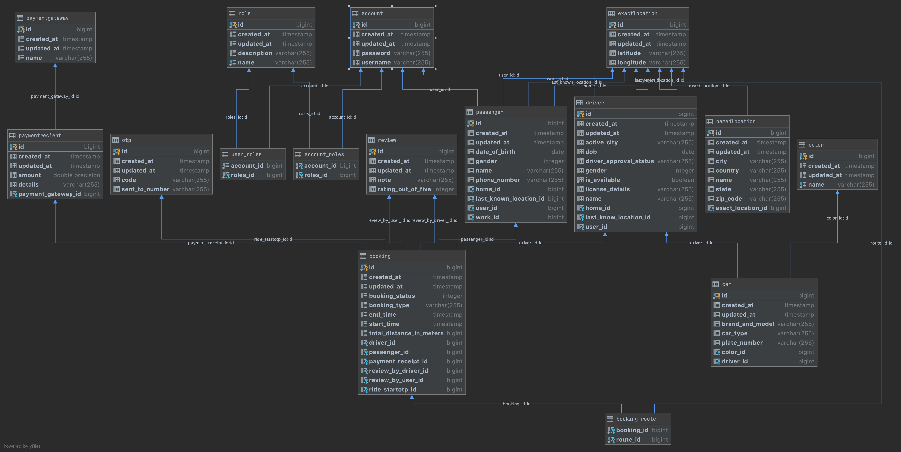

# Uber-Api-Design
Designing MVP for a cab booking application similar to Uber.

* Requirements.
* Low Level Design.
* High Level Design.
* API Design.
* Building Microservices.
* Deploying Services.

Technologies Used - Spring Boot, Hibernate, JPA, PostgresSQL, Redis.

# Discussion Points:

- [x] FEATURE EXPECTATIONS (5 mins)
- Use cases.
- Scenarios that we can ignore.
- Who will use.
- How many will use.
- Usage patterns.
- [x] ESTIMATIONS (5 mins)
- Throughput (QPS for read and write queries)
- Latency expected from the system (for read and write queries)
- Read/Write ratio
- Traffic estimates
	- Write (QPS, Volume of data)
	- Read  (QPS, Volume of data)
- Storage estimates
- Memory estimates
	- If we are using a cache, what is the kind of data we want to store in cache
	- How much RAM and how many machines do we need for us to achieve this ?
	- Amount of data you want to store in disk/ssd
- [x] DESIGN GOALS (5 mins)
- Latency and Throughput requirements
- Consistency vs Availability  [Weak/strong/eventual => consistency | Failover/replication => availability]
- [x] HIGH LEVEL DESIGN [5-10 min]
- APIs for Read/Write scenarios for crucial components
- Database schema
- Basic algorithm
- High level design for Read/Write scenario
- [x] DEEP DIVE [15-20 min]
- Scaling the algorithm
- Scaling individual components: 
	- Availability, Consistency and Scale story for each component
	- Consistency and availability patterns
- Think about the following components, how they would fit in and how it would help
	- DNS
	- CDN [Push vs Pull]
	- Load Balancers [Active-Passive, Active-Active, Layer 4, Layer 7]
	- Reverse Proxy
	- Application layer scaling [Microservices, Service Discovery]
	- DB [RDBMS, NoSQL]
		- RDBMS 
		    - Master-slave, Master-master, Federation, Sharding, Denormalization, SQL Tuning
		- NoSQL
		    - Key-Value, Wide-Column, Graph, Document
			- Fast-lookups:
			    - RAM  [Bounded size] => Redis, Memcached
			    - AP [Unbounded size] => Cassandra, RIAK, Voldemort
			    - CP [Unbounded size] => HBase, MongoDB, Couchbase, DynamoDB
	- Caches
		- Client caching, CDN caching, Webserver caching, Database caching, Application caching, Cache @Query level, Cache @Object level
		- Caching techniques:
			- Cache aside
			- Write through
			- Write behind
			- Refresh ahead
		- Eviction techniques:
			- Time based eviction.
			- First in, first out (FIFO).
			- First in, last out (FILO).
			- Least Recently accessed.
			- Least time between access.
	- Asynchronism
		- Message queues
		- Task queues
		- Back pressure
	- Communication
		- TCP
		- UDP
		- REST
		- RPC
- [x] JUSTIFY [5 min]
- Throughput of each layer
- Latency caused between each layer
- Overall latency justification

# Requirements:

  ### Passengers: 

* Passengers register by entering the phone number and confirming the OTP
* Passenger can request a cab booking by entering source and destination.
* Before booking the cab, passenger will see the ETA for the booking, the expected ride duration and the expected cost.
* After booking the ride also passenger should be able to see their ETA, expected ride duration and expected cost.
* Booking can be scheduled for now, or can be scheduled for a later time - max 3 days.
* Passenger can cancel an upcoming booking, if booking is scheduled for later time.
* A ride in progress cannot be cancelled - it can only be ended by the driver and passenger must pay some amount after ending the ride from driver side based on payment method.
* A Passenger can rate their experience of the current booking during the ride or after the ride has ended.
* Passengers can see their past, current and upcoming bookings.
* Passenger can update profile, update payment methods and other profile specific requirements.
* Ride sharing can be part of extensible feature.

  ### Booking:

* There are multiple types of bookings available - XL, Pool, Prime, Go, Rental
* When making a booking, the passenger must choose the type of booking.
* Once a booking is requested, the nearby drivers are alerted about the booking 
* The first driver to accept the booking is allotted to it.
* Drivers are chosen based on ETA to the location.
* While the trip is active, the passenger can add/remove/rearrange the stops, and the driver will be notified in real time.
* To start a ride, the passenger must share an OTP with the driver.
* The driver can end the ride at any time.

  ### Driver:
* After registering the driver must fill their profile and car details.
* The driver is allowed to accept rides only after their profile is approved by the admin.
* Only one car can be registered with one account. If a driver has multiple cars, they must use different accounts.
* Driver can see what booking they can accept, based on the real time notifications they are getting.
* Driver can see the expected earning from a booking.
* Driver can choose to accept a booking or to ignore it.
* Driver should not drive more than 14-hrs per day, so we should restrict the driver to further accept any bookings.

  ### System:
* The system must track each cab in real time.
* The system must should have a basic observability for different processes.
* Passenger can request a new booking only if they don’t have any pending payment.
* Admin panel to see statistics or any other admin related stuffs.

  ### Schema Design:

